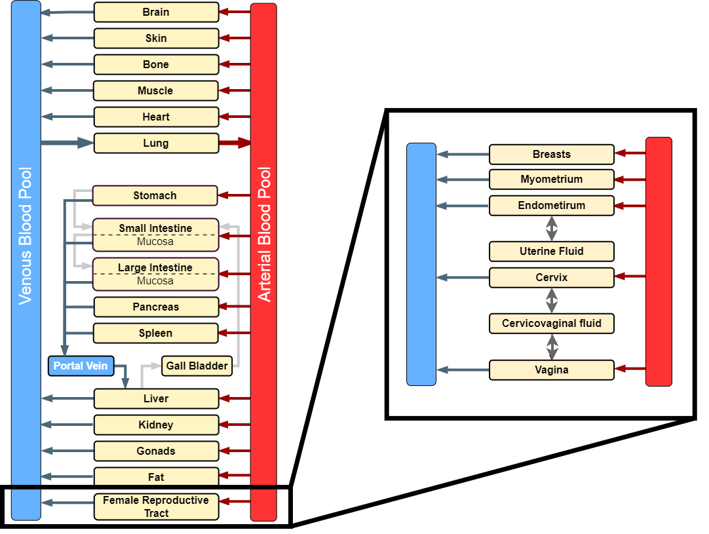

# Physiologically Based Pharmacokinetic Models for the Female Reproductive Tract

Within this repository, we distribute MoBi® modules for the female reproductive tract. The module is an extension of the whole-body physiologically based pharmacokinetic models developed in Open Systems Pharmacology. The extension module can be used to simulate transfer of medicines towards female reproductive tract organs, or to simulate pharmacokinetics of compounds after local administration.

The extension module consists of five tissue compartments (endometrium, myometrium, vagina, cervix and breasts) and two fluid compartments (uterine fluid and cervicovaginal fluid) that can be added to a PBPK base model. This module does not consider the external part of the female reproductive tract. Furthermore, ovaries and fallopian tubes are not included due to lack of data. All tissue compartments have the same sub-compartmentalization as the tissues of the base whole-body structure.

Discover how different administration routes affec drug exposure of levonorgestrel or metrinodazole via our shiny app [FemSim](https://femsim.esqlabs.com/).

## Repository files

### Models
The folder contains MoBi® project files for the developed PBPK models. 
- **Metronidazole-Model**: Metronidazole is an antibiotic and antiprotozoal medication used to treat a range of infections, including bacterial vaginosis, trichomoniasis and endometritis. A PBPK model for IV administration of metronidazole is available from [Github](https://github.com/Open-Systems-Pharmacology/Pregnancy-Models.git) ([Dallmann 2018](#references)), and was extended for oral administration to obtain the base PBPK model. The PBPK model was applied for the female reproductive tract after intravenous, oral and vaginal administration.
- **Levonorgestrel-Model**: Levonorgestrel is a synthetic progestogen widely used in various hormonal contraceptive formulations. The base PBPK model for levonorgestrel is available from [Github](https://github.com/Open-Systems-Pharmacology/Levonorgestrel) ([Cicali 2021](#references)). The PBPK model was applied for the female reproductive tract after oral and intrauterine (IUD) administration.

### Modules
The extension modules are provided in the subfolder Modules. The following extension modules are available:
- **Female reproductive tract extension module**.
- **Administration modules** including local administration for levonorgestrel and metronidazole.

### R_FRT_Parameters
Two R scripts are available to support the parametrization of the female reproductive tract module in the absence of *in vivo* and/or *in vitro* data. 

- **DiffusionParameter**: QSAR calculation of the diffusion coefficient between the fluid and tissue compartments in the female reproductive tract ([Chen 2015](#references)).
- **FractionUnionized**: calculation of the unionized fraction in cervicovaginal fluid and uterine fluid based on the Henderson-Hasselbalch equation.

### Reports
The subfolder Rreports contains evaluation reports and the {esqlabsR} project to generate the reports. The module has been evaluated with metronidazole and levonorgestrel.

## How to extend a base PK-Sim® PBPK model for the female reproductive tract in (MoBi®)

We have developed a free course trough the ESQlabs E-learning platform to learn how to extend a physiologically-based pharmacokinetic (PBPK) model with the female reproductive tract extension module.

- Click the link: [Female Reproductive Tract course](https://lnkd.in/deiVWGvF). 
- If you already have an account, log in with your existing credentials and enjoy the course!
- If this is your first time on the E-learning Portal, Click 'Sign up for free' and enter your details. You'll receive an email with your access information shortly after.

## Version information

The MoBi® project files and modules were created in version 12.

## Code of conduct

Everyone interacting in the Open Systems Pharmacology community (codebases, issue trackers, chat rooms, mailing lists, etc.) is expected to follow the Open Systems Pharmacology [code of conduct](https://github.com/Open-Systems-Pharmacology/Suite/blob/master/CODE_OF_CONDUCT.md#contributor-covenant-code-of-conduct).

## Contribution

We encourage contributions to the Open Systems Pharmacology community. Before getting started, please read the [contribution guidelines](https://github.com/Open-Systems-Pharmacology/Suite/blob/master/CONTRIBUTING.md#ways-to-contribute). If you are contributing code, please be familiar with the [coding standard](https://github.com/Open-Systems-Pharmacology/Suite/blob/master/CODING_STANDARDS.md#visual-studio-settings).

## License

The model code is distributed under the [GPLv2 License](https://github.com/Open-Systems-Pharmacology/Suite/blob/develop/LICENSE).

## References

**Chen 2015** Chen L, Han L, Saib O, Lian G. In silico prediction of percutaneous absorption and disposition kinetics of chemicals. Pharm Res. 2015 May;32(5):1779-93. doi: 10.1007/s11095-014-1575-0.

**Cicali 2021** Cicali B, Lingineni K, Cristofoletti R, Wendl T, Hoechel J, Wiesinger H, Chaturvedula A, Vozmediano V, Schmidt S. Quantitative Assessment of Levonorgestrel Binding Partner Interplay and Drug-Drug Interactions Using Physiologically Based Pharmacokinetic Modeling. CPT Pharmacometrics Syst Pharmacol. 2021 Jan;10(1):48-58. doi: 10.1002/psp4.12572. 

**Dallmann 2018** Dallmann A, Ince I, Coboeken K, Eissing T, Hempel G. A Physiologically Based Pharmacokinetic Model for Pregnant Women to Predict the Pharmacokinetics of Drugs Metabolized Via Several Enzymatic Pathways. Clin Pharmacokinet. 2018 Jun;57(6):749-768. doi: 10.1007/s40262-017-0594-5. PMID: 28924743.
